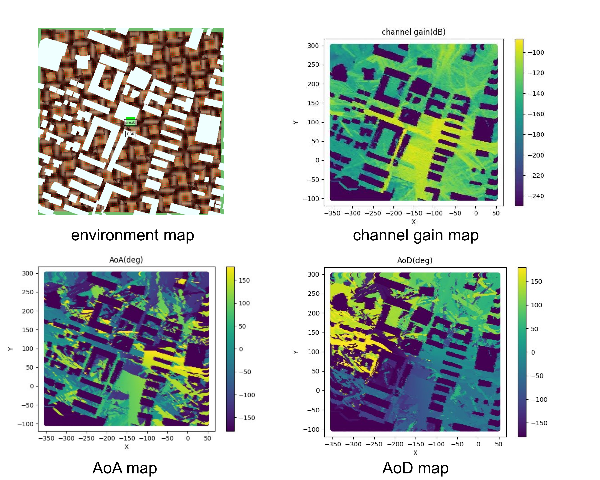
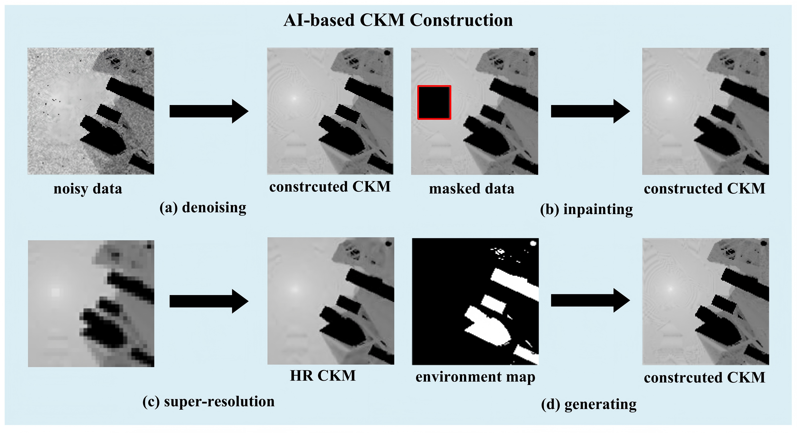

# 👋 CKMImageNet Dataset Showcase
This is my GitHub Pages site for displaying the [CKMImageNet Dataset](https://github.com/zyktzCKM/CKMImageNet).

# ❓ What Is CKM
CKM is a site-specific database that provides location-specific channel knowledge. It offers a promising method to enable environment-awareness — this facilitates or even avoids sophisticated real-time CSI acquisition or redundant environment sensing.

## 📚 Dataset Introduction
CKMImageNet is a dataset bridging the gap between AI and environment-aware wireless communication environment-aware research for 6G systems. It integrates location-specific channel data, multi-resolution channel knowledge images and physical environmental maps, with both numerical and visual representations. 

## 🚀 Key Features
1. CKMImageNet is constructed through physics-based ray-tracing simulations using advanced tools like Wireless Insite and Sionna.
2. CKMImageNet provides multi-dimensional channel knowledge spanning channel gain, AoA, AoD, propagation delay, and other key parameters.
3. CKMImageNet introduces normalized, spatially consistent and location-specific grayscale images (32 × 32, 64 × 64, 128 × 128 pixels) encoding multi-dimensional channel parameters.
4. CKMImageNet pioneers the tight coupling of numerical channel data, binary obstacle matrices, and grayscale CKMs into a unified framework.

## 📊 Data Presentation

*Figure: Schematic diagram of CKMImageNet dataset structure (from dataset_01.png)*

## ❓ How to use the CKMImageNet dataset?

### Normalization Rules for Image Data
- Channel gain maps: Normalized from **-250 dB ~ -50 dB** to the range of **0 ~ 1**.
- AoA/AoD maps: Normalized from **-200° ~ 180°** to the range of **0 ~ 1**.

> Note: The value of `-250 dB` for gain maps and `-200°` for angle maps are practically unreachable. They are specifically used to mark **building areas** (distinguishing valid channel data from obstacle regions).

### Usage of Image Data for AI Training Tasks
Leveraging CKMImageNet’s large-scale, multi-dimensional, and spatially consistent image data enables diverse AI training tasks (aligned with the case studies), addressing key challenges in environment-aware 6G systems, following are some examples:

- **CKM Denoising**  
  The image dataset (encoding channel gain, AoA/AoD, etc.) trains AI models (e.g., diffusion models, GANs) to filter noise from real-world CKM data (corrupted by sensor imperfections or environmental interference). By learning from CKMImageNet’s noise-free, environment-aligned image features, these models recover true channel characteristics—improving CKM accuracy for system optimization.

- **CKM Inpainting**  
  For missing CKM regions (e.g., safety-restricted areas), the image data supports training conditional models (e.g., conditional diffusion models) to impute missing information. With CKMImageNet’s fused obstacle maps (environmental context like building layouts), these models restore large missing regions (e.g., entire city blocks) more effectively than traditional methods (KNN, Kriging).

- **CKM Super-Resolution**  
  The multi-resolution image data (32×32/64×64/128×128) trains super-resolution models (e.g., ResNet-based networks) to upscale low-resolution CKM images (from coarse measurements) to high-resolution maps. This enhances spatial detail critical for high-precision tasks (e.g., beamforming in ultra-massive MIMO systems).

- **CKM Generation**  
  Generative models (trained on the image dataset) synthesize high-quality CKMs for environments with sparse measurements (e.g., complex urban areas). By integrating environmental-channel causal relationships from CKMImageNet, these models enable CKM expansion for 6G scenario research.

## 🔗 Access the Dataset
- GitHub Repository: [zyktzCKM/CKMImageNet](https://github.com/zyktzCKM/CKMImageNet)
